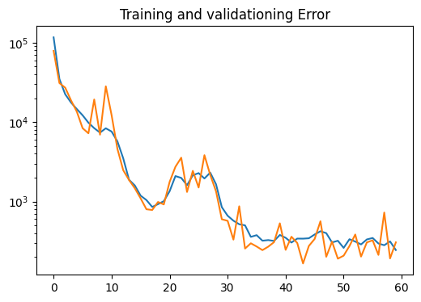

# Lab 8: Vision Lab

## The x, y distance of the unknown cones?
The bottom right of cone_unknown.png is (60.33644841802973, -12.734433055098743, 0) in the car's reference frame.

## Lane Detection Result Image

## Integrated Object Detection + Distance Calculation Result Image

## Nerual Network Training & Testing Loss Plot

Orange line is training loss and blue line is testing loss. 

## Is FP16 faster? Why?
FP16 inference time (ms): 0.04668 seconds

FP32 inference time (ms): 0.05167 seconds

You should time only the inference part and average out at least 100 inference cycles.

FP16 is faster than FP32 because of the following reasons:

Reduced Memory Bandwidth: FP16 requires half the memory bandwidth of FP32, allowing for faster data transfers between the GPU memory and the processing units.

Reduced Memory Footprint: Because FP16 uses half the number of bits to represent a value compared to FP32, it takes up less memory. This allows for more efficient use of memory resources and can reduce the time spent on memory operations.

Tensor Cores: Modern GPUs include specialized hardware called Tensor Cores, which are designed to accelerate matrix multiplication operations used in deep learning. Tensor Cores are optimized for performing mixed-precision calculations using FP16, which can significantly speed up neural network inference.

Increased Parallelism: TensorRT can take advantage of the increased parallelism offered by using FP16. By performing multiple calculations in parallel, TensorRT can accelerate the inference of neural networks.
